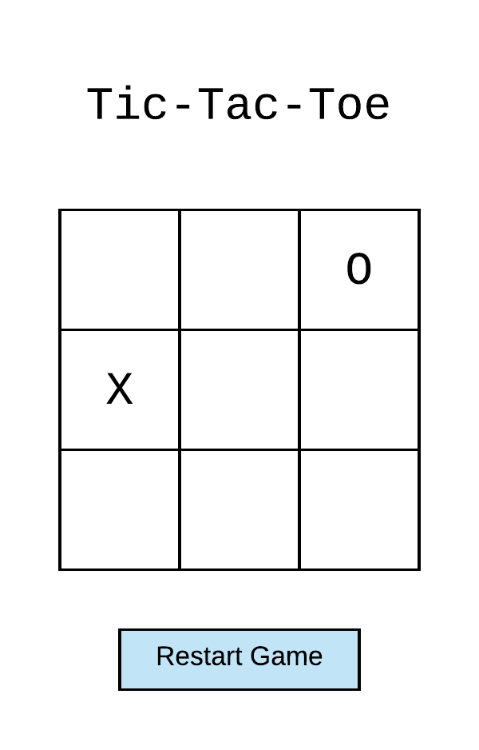

### Tic tac toe

Skull and bones
x = img
0 = img

Disabled btn

If x === 
If o ===

Let Turn = ''
Change turn inside function

placeHolder.setAttribute('url', 'x')

---

### Requirements
- single div  
    

### Stretch goals
- Build with mvc design principles
- player names
- Keep track of number of games won
- Link rules
- AI
- Connect 4
- Recreate Go

## Pseudocode
### State
- Players turn: x or o
- Win Conditions: 8 conditions
   - Grid win conditions  ABC/123
      a1 b2 c3 all x
    - Array win conditions Or array indexes combinations of index values
      [0,1,2], [3,4,5], [0,3,6]
- Board state: ['','0','','','','','','','x'] length 9
    - update state with xo values after turn
- gameActive:
- Winner: header text = `${winner} wins`
    - background = red
    - dont need to check win conditions till move 5
- Draw:
- marker x or o
    - updated in player functions to be x or o?
- turn count: 

### Event listener
- click, element.appendChild(img)

<button = disabled></button>

### Questions
- How do we track moves?
- How do we know what has been played?
- Change player?

### Basic Layout

<h1>`${turn}'s turn`</> <!-- output example = "X's turn"-->

    

    

    

    

    

    

    

    

    

---
if (turnCount > 5){
    checkWin(){
        checks after every turn if win conditionals are met
    }
}

CreateElements(){
    dynamically create elements
}

mainElements(){
    creates elements on load
}

init(){
    create button(render elements)
    or create elements on load
}

reset(){
    resets game
}

resetBtn('click'){
    reset()
}

turn(){
    If(turn===x) {
    xTurn ()
    } Else if (turn === o) {
    oTurn()
    }
}

Function xTurn {
    Document.body.style.backgroundColor = black
    Document.body.style.color = white

click tile inner html = x
click disable button

turn count++

    Turn = o
}

Function oTurn {
    Document.body.style.backgroundColor = white
    Document.body.style.backgroundColor = black

    click tile inner html = o
    click disable button

    turn count++

    Turn = x
}

